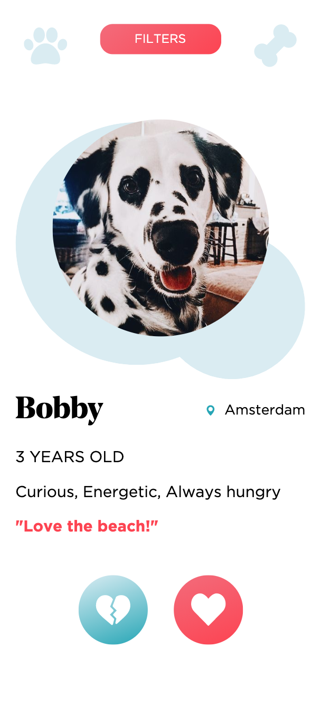

# dating-app-feature
**Feature voor een dating app van blok-tech**


> Home page where are the profiles will be shown.

## Table of Contents
* **[How to install](#how-to-install)**
* **[Concept](#concept)**
* **[Data model](#data-model)**
* **[Resources](#resources)**
* **[Credits](#credits)**
* **[License](#license)**

## How to install

Before installing make sure you have installed node.js and npm.
Choose or make a new directory.
Load the template into your directory.

```bash
git clone https://github.com/chelseadoeleman/dating-app-feature.git
```

Make sure you are in the right directory 
```bash
cd dating-app-feature
```

Check if you have the latest version of npm.
Install the dependencies in [package.json](./package.json)
```bash
npm install
```
To run the script 
```bash
npm run start
```
or if you're using nodemon
```bash
npm run start-server
```

## Concept

**Job Story**
*When* I see a person. *I want to* know a little more about them. *So I can* decide whether to like or dislike them.

In my application you can browse through user profiles and like or dislike them. When that other person likes you back, you will get a match! 
> Not not working in the application yet, because right now you have a default user profile

When you have a match a page will be renderd with all your matches, so you can schedule an appointment to go on a walk together with your beloved dogs. 

## Data model

```json
{
    "name": String,
    "age": Number,
    "location": String,
    "characteristics": String,
    "bio": String,
    "instagram": String,
    "measurements": String,
    "images": Array,
    "matches": Array
}

```
> This is how the data model looks right now. When you have a match their ID will be pushed into your matches Array. 

```json
{
    "name": String,
    "age": Number,
    "location": String,
    "characteristics": String,
    "bio": String,
    "instagram": String,
    "measurements": String,
    "images": Array,
    "matches": Array,
    "unanswered": Array
}

```

> This is kinda how the data model looks should look when you are able to log in. The people you like will be stored in unanswered, until they like or dislike you back. In case of a dislike, their Id will be removed. In case of a like their Id will be stored in matches.

## Resources

## Credits

## License
This repository is licensed as [MIT](LICENSE) by [Chelsea Doeleman](https://github.com/chelseadoeleman)